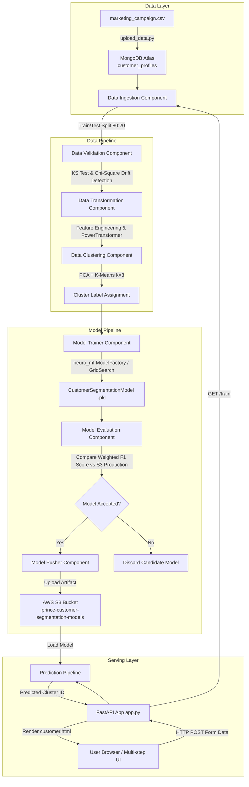

# Customer Personality Segmentation & AI Predictor

[](https://www.python.org/)
[](https://fastapi.tiangolo.com/)
[](https://scikit-learn.org/)
[](https://www.mongodb.com/)
[](https://aws.amazon.com/s3/)
[](https://www.docker.com/)
[](https://render.com/)

An end-to-end Machine Learning system and interactive web platform that analyzes customer profiles, performs unsupervised behavioral clustering, and deploys a supervised classification model to categorize customers into distinct personality segments.

---

## Executive Overview

Understanding customer personality and purchasing behavior is critical for targeted marketing campaigns, customer retention, and personalized product recommendations. This repository implements a production-ready, dual-stage Machine Learning architecture:

1. **Unsupervised Behavioral Clustering**: Evaluates historical customer profile records from **MongoDB Atlas**, performs feature engineering, applies numerical power transformations and standardization, reduces dimensionality with **Principal Component Analysis (PCA)**, and automatically assigns ground-truth behavioral cluster labels ($k=3$) using **K-Means Clustering**.
2. **Supervised Classification Modeling**: Trains a high-performance **Logistic Regression** classifier (configured via `neuro_mf` `ModelFactory`) to map engineered customer features directly to their predicted cluster segment in real time.
3. **Automated Pipeline Orchestration**: Enforces automated data ingestion, statistical data drift detection (**Kolmogorov-Smirnov** and **Chi-Square** tests), pipeline artifact management, AWS S3 model evaluation against production benchmarks, and cloud model pushing.
4. **Interactive Web Application**: Features a modern, responsive 3-step multi-stage web UI built with **FastAPI**, **Jinja2**, and **Tailwind CSS**, allowing users to input customer metrics and obtain real-time cluster segment predictions.

---

## Architecture & System Workflow



---

## Directory Structure

```
Customer-Segmentation/
├── .github/
│   └── workflows/
│       └── deploy.yml              # GitHub Actions CI/CD deployment workflow to Render
├── config/
│   ├── model.yaml                  # Model selection & GridSearch configuration (neuro_mf)
│   ├── prediction_schema.yaml      # Schema definition for prediction feature inputs
│   └── schema.yaml                 # Database ingestion schema & column exclusion rules
├── notebooks/
│   ├── EDA.ipynb                   # Exploratory Data Analysis notebook
│   ├── Feature_Engineering_and_Classification.ipynb  # Classification experiments
│   ├── Feature_Engineering_and_Clustering.ipynb      # PCA & K-Means clustering experiments
│   ├── marketing_campaign.csv      # Raw customer marketing campaign dataset
│   └── model.pkl                   # Trained model artifact reference
├── src/
│   ├── cloud_storage/
│   │   └── aws_storage.py          # S3 storage helper (upload, download, key check)
│   ├── components/
│   │   ├── data_clustering.py      # PCA dimensionality reduction & K-Means clustering
│   │   ├── data_ingestion.py       # MongoDB data extraction & train/test splitting
│   │   ├── data_transformation.py  # Feature engineering, imputation & power transformation
│   │   ├── data_validation.py      # Schema validation & statistical drift reporting
│   │   ├── model_evaluation.py     # Weighted F1 model evaluation against S3 production model
│   │   ├── model_pusher.py         # Push approved model artifacts to S3
│   │   └── model_trainer.py        # Supervised classifier training using neuro_mf
│   ├── configuration/
│   │   ├── aws_connection.py       # AWS Boto3 client/resource singleton initialization
│   │   └── mongodb_connection.py   # PyMongo client initialization with TLS certificates
│   ├── constant/
│   │   ├── application.py          # Server host and port configuration
│   │   ├── database.py             # Database and collection names
│   │   ├── env_variable.py         # Environment variable key definitions
│   │   ├── prediction_pipeline/    # Prediction pipeline constant paths
│   │   ├── s3_bucket.py            # AWS S3 model bucket configuration
│   │   └── training_pipeline/      # Training pipeline constants & default thresholds
│   ├── data_access/
│   │   └── customer_data.py        # Export MongoDB collections into pandas DataFrames
│   ├── entity/
│   │   ├── artifact_entity.py      # Data classes for pipeline phase output artifacts
│   │   └── config_entity.py        # Data classes for component configuration settings
│   ├── exception/
│   │   └── __init__.py             # Custom CustomerException error handling wrapper
│   ├── logger/
│   │   └── __init__.py             # Logging setup for console and file loggers
│   ├── ml/
│   │   ├── metric/
│   │   │   └── __init__.py         # Classification metrics (F1, Precision, Recall, Cost)
│   │   └── model/
│   │       ├── estimator.py        # CustomerSegmentationModel wrapper class
│   │       └── s3_estimator.py     # CustomerClusterEstimator S3 loader & predictor
│   ├── pipeline/
│   │   ├── prediction_pipeline.py  # Single-row input processing & prediction engine
│   │   └── train_pipeline.py       # End-to-end training pipeline orchestrator
│   └── utils/
│       └── main_utils.py           # YAML, pickle, and numpy array utilities
├── static/                         # Static assets directory
├── templates/
│   └── customer.html               # 3-step interactive UI (Tailwind CSS, Jinja2, JS)
├── .dockerignore                   # Files excluded from Docker image builds
├── .env                            # Environment variables (credentials & configs)
├── .gitignore                      # Git exclusion rules
├── app.py                          # FastAPI web application entry point
├── Dockerfile                      # Production Docker container definition
├── requirements.txt                # Python project dependencies
├── setup.py                        # Package setup file for src module
├── test_mongo.py                   # MongoDB connection test script
├── test_s3.py                      # AWS S3 connection test script
└── upload_data.py                  # Script to seed MongoDB Atlas from raw CSV
```

---

## Detailed Pipeline Breakdown

The project follows a modular design pattern with distinct components executing specific tasks:

### 1. Data Ingestion ([`src/components/data_ingestion.py`](file:///d:/Skills/Projects/Customer-Segmentation/src/components/data_ingestion.py))
- Connects to **MongoDB Atlas** via [`CustomerData`](file:///d:/Skills/Projects/Customer-Segmentation/src/data_access/customer_data.py).
- Extracts records from the `customer_profiles` collection into a pandas DataFrame.
- Drops metadata columns defined in [`config/schema.yaml`](file:///d:/Skills/Projects/Customer-Segmentation/config/schema.yaml) (`ID`, `Z_CostContact`, `Z_Revenue`).
- Performs an 80:20 train-test split and persists CSVs into `artifact/<timestamp>/data_ingestion/ingested/`.

### 2. Data Validation ([`src/components/data_validation.py`](file:///d:/Skills/Projects/Customer-Segmentation/src/components/data_validation.py))
- Validates DataFrame schema column counts against predefined expectations.
- **Statistical Drift Detection**:
  - **Numerical Features**: Computes two-sample **Kolmogorov-Smirnov (KS) Tests** ($p < 0.05$).
  - **Categorical Features**: Computes **Chi-Square Contingency Tests** ($p < 0.05$).
- Saves a detailed drift report YAML to `artifact/<timestamp>/data_validation/drift_report/report.yaml`.

### 3. Data Transformation ([`src/components/data_transformation.py`](file:///d:/Skills/Projects/Customer-Segmentation/src/components/data_transformation.py))
- **Feature Engineering**:
  - Calculates `Age` ($\text{Current Year} - \text{Year\_Birth}$).
  - Encodes `Education` (`Basic`: 0, `2n Cycle`: 1, `Graduation`: 2, `Master`: 3, `PhD`: 4).
  - Encodes `Marital Status` (`Married`/`Together`: 1, others: 0).
  - Computes `Children` ($\text{Kidhome} + \text{Teenhome}$) and `Family_Size` ($\text{Marital Status} + \text{Children} + 1$).
  - Computes `Total_Spending` ($\text{Wines} + \text{Fruits} + \text{Meat} + \text{Fish} + \text{Sweets} + \text{Gold}$).
  - Computes `Total Promo` ($\sum \text{AcceptedCmp1..5}$) and `Offers_Responded_To`.
  - Calculates customer tenure (`Days_as_Customer`) from `Dt_Customer`.
  - Derives `Parental Status` ($1$ if $\text{Children} > 0$ else $0$).
- **Preprocessing Pipeline**:
  - Missing values imputed using `SimpleImputer(strategy='constant', fill_value=0)`.
  - Skewed spending and age attributes (`Wines`, `Fruits`, `Meat`, `Fish`, `Sweets`, `Gold`, `Age`, `Total_Spending`) transformed using `PowerTransformer(standardize=True)`.
  - Remaining numerical features scaled via `StandardScaler()`.
  - Saves preprocessing artifact (`preprocessing.pkl`).

### 4. Data Clustering ([`src/components/data_clustering.py`](file:///d:/Skills/Projects/Customer-Segmentation/src/components/data_clustering.py))
- Applies **PCA** (`n_components=2`) to reduce preprocessed features into two principal components.
- Fits a **K-Means** clustering model ($k=3$) on the reduced space.
- Appends the generated cluster labels ($0, 1, 2$) as the target column (`cluster`) to the training and testing datasets.

### 5. Model Training ([`src/components/model_trainer.py`](file:///d:/Skills/Projects/Customer-Segmentation/src/components/model_trainer.py))
- Reads model configurations from [`config/model.yaml`](file:///d:/Skills/Projects/Customer-Segmentation/config/model.yaml).
- Leverages `neuro_mf.ModelFactory` to perform GridSearch hyperparameter tuning for **Logistic Regression** ($C=1000$, $\text{solver}=\text{'lbfgs'}$, $\text{penalty}=\text{'l2'}$).
- Verifies model accuracy against an expected threshold ($0.60$).
- Wraps the preprocessor and trained estimator into a unified [`CustomerSegmentationModel`](file:///d:/Skills/Projects/Customer-Segmentation/src/ml/model/estimator.py) object and saves it as `model.pkl`.

### 6. Model Evaluation ([`src/components/model_evaluation.py`](file:///d:/Skills/Projects/Customer-Segmentation/src/components/model_evaluation.py))
- Fetches the existing production model from the **AWS S3** bucket ([`prince-customer-segmentation-models`](file:///d:/Skills/Projects/Customer-Segmentation/src/constant/s3_bucket.py)) using [`CustomerClusterEstimator`](file:///d:/Skills/Projects/Customer-Segmentation/src/ml/model/s3_estimator.py).
- Evaluates the weighted F1-score of both the newly trained model and the S3 production model on test data.
- Accepts the new model if its weighted F1-score improves upon the active production model.

### 7. Model Pusher ([`src/components/model_pusher.py`](file:///d:/Skills/Projects/Customer-Segmentation/src/components/model_pusher.py))
- Uploads the accepted `model.pkl` to AWS S3 storage for live application inference.

---

## Feature Engineering & Preprocessing Matrix

| Feature Name | Input / Derived | Data Type | Transformation Method | Description |
| :--- | :--- | :--- | :--- | :--- |
| `Age` | Derived | `int` | `PowerTransformer` | Derived from `Year_Birth` |
| `Education` | Encoded | `int` | `StandardScaler` | Recoded ordinal values ($0$ to $4$) |
| `Marital Status` | Encoded | `int` | `StandardScaler` | Binary indicator ($1$ for partnered, $0$ otherwise) |
| `Parental Status` | Derived | `int` | `StandardScaler` | Binary indicator ($1$ if $\text{Children} > 0$) |
| `Children` | Derived | `int` | `StandardScaler` | Sum of `Kidhome` + `Teenhome` |
| `Income` | Input | `float` | `StandardScaler` | Customer annual household income |
| `Total_Spending` | Derived | `float` | `PowerTransformer` | Sum of spending across all 6 product categories |
| `Days_as_Customer` | Derived | `int` | `StandardScaler` | Days since enrollment date `Dt_Customer` |
| `Recency` | Input | `int` | `StandardScaler` | Days since last purchase |
| `Wines` | Input | `int` | `PowerTransformer` | Amount spent on wine in last 2 years |
| `Fruits` | Input | `int` | `PowerTransformer` | Amount spent on fruits in last 2 years |
| `Meat` | Input | `int` | `PowerTransformer` | Amount spent on meat in last 2 years |
| `Fish` | Input | `float` | `PowerTransformer` | Amount spent on fish in last 2 years |
| `Sweets` | Input | `int` | `PowerTransformer` | Amount spent on sweets in last 2 years |
| `Gold` | Input | `float` | `PowerTransformer` | Amount spent on gold products in last 2 years |
| `Web` | Input | `int` | `StandardScaler` | Number of purchases made via website |
| `Catalog` | Input | `int` | `StandardScaler` | Number of purchases made using catalog |
| `Store` | Input | `int` | `StandardScaler` | Number of purchases made directly in store |
| `Discount Purchases`| Input | `int` | `StandardScaler` | Number of purchases made with discount |
| `Total Promo` | Derived | `int` | `StandardScaler` | Total promotions accepted ($\sum \text{AcceptedCmp1..5}$) |
| `NumWebVisitsMonth` | Input | `int` | `StandardScaler` | Web visits in the last month |

---

## Interactive Web Application

The project includes a **FastAPI** web application serving a 3-step form UI built with **Tailwind CSS** and **Jinja2**:

- **Step 1: Customer Demographics**: Age, Education level, Marital status, Parental status, Children count, Annual Income, and Days as customer.
- **Step 2: Purchase Behaviour**: Product expenditure breakdowns across Wine, Fruits, Meat, Fish, Sweets, Gold, Total Spending, and Recency.
- **Step 3: Shopping & Channel Engagement**: Web, Catalog, and Store purchase frequencies, Discount purchases, Total promotions accepted, and Monthly web visits.
- **Interactive UI Features**:
  - Light/Dark mode switcher with persistent `localStorage` theme state.
  - Step-by-step progress indicators and form validation.
  - Real-time prediction banner displaying the assigned customer cluster segment upon form submission.

---

## API Reference

| Method | Path | Description | Parameters / Payload | Response |
| :--- | :--- | :--- | :--- | :--- |
| `GET` | `/` | Renders interactive prediction UI | None | HTML Page (`customer.html`) |
| `POST` | `/` | Form submission endpoint for prediction | Form Data (21 customer attributes) | HTML Page with predicted cluster ID |
| `GET` | `/train` | Triggers full retraining pipeline | None | Plain Text (`Training Successful!!`) |

---

## Environment Configuration

Create a `.env` file in the root directory before running the application:

```env
# MongoDB Atlas Configuration
MONGO_DB_URL=mongodb+srv://<username>:<password>@cluster.mongodb.net/?appName=CustomerSegmentationCluster

# AWS S3 Configuration
AWS_ACCESS_KEY_ID=your_aws_access_key_id
AWS_SECRET_ACCESS_KEY=your_aws_secret_access_key
AWS_REGION=ap-south-1

# Application Server Configuration
PORT=5000
```

---

## Installation & Local Setup

### 1. Prerequisites
- Python 3.10+
- MongoDB Atlas cluster (or local instance)
- AWS S3 Bucket created (`prince-customer-segmentation-models`)

### 2. Setup Virtual Environment
```bash
# Clone the repository
git clone https://github.com/ydv-prince/Customer-Segmentation.git
cd Customer-Segmentation

# Create a virtual environment
python -m venv venv

# Activate the virtual environment
# Windows (PowerShell):
.\venv\Scripts\Activate.ps1
# Linux/macOS:
source venv/bin/activate
```

### 3. Install Dependencies
```bash
pip install -r requirements.txt
pip install -e .
```

### 4. Seed MongoDB Database
Populate your MongoDB collection with initial customer dataset records:
```bash
python upload_data.py
```

### 5. Run the Training Pipeline
To trigger model ingestion, drift validation, transformation, clustering, training, evaluation, and pushing:
```bash
# Option 1: Execute via Python script or endpoint
python -c "from src.pipeline.train_pipeline import TrainPipeline; TrainPipeline().run_pipeline()"
```

### 6. Start the Web Server
Launch the FastAPI application:
```bash
python app.py
```
Open your browser and navigate to:
```
http://localhost:5000
```

---

## Containerization & Cloud Deployment

### Docker Deployment

Build and run the container locally:

```bash
# Build the Docker image
docker build -t customer-segmentation .

# Run the container
docker run -p 5000:5000 --env-file .env customer-segmentation
```

### Render Deployment (CI/CD)

The project includes an automated GitHub Actions workflow ([`.github/workflows/deploy.yml`](file:///d:/Skills/Projects/Customer-Segmentation/.github/workflows/deploy.yml)) that deploys to **Render** via deploy hook webhooks:

1. Add your `RENDER_DEPLOY_HOOK_URL` secret to your GitHub Repository Settings under **Secrets and variables > Actions**.
2. Push commits to the `main` branch to automatically trigger deployment.

---

## Author & License

Developed by **Prince** ([pkumar052@rku.ac.in](mailto:pkumar052@rku.ac.in)).
